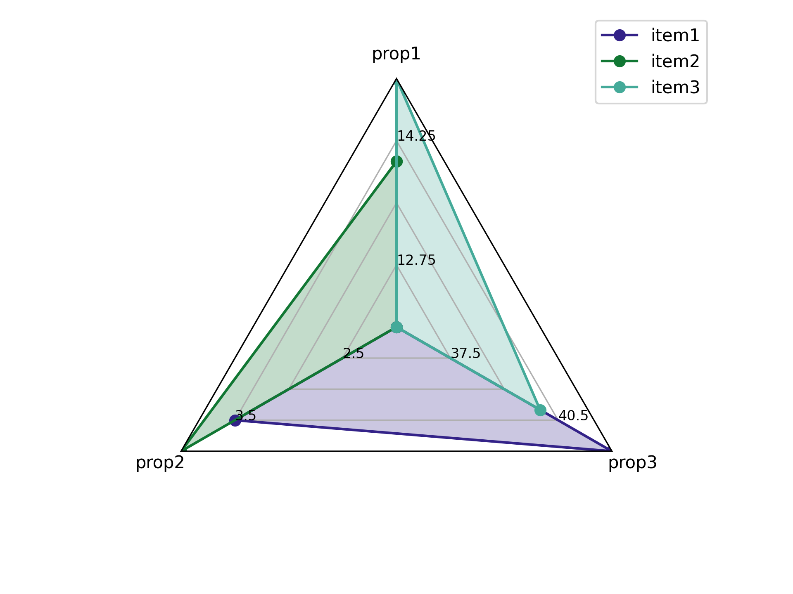

# Radar plot
This package creates radar plots. It can generate typical radar plots and 
plot ranges of values.

## Data formatting
Data you want to plot must have a tidy format. For instance, if I wanted to plot
three properties (let's say prop1, prop2, and prop3 with values 
12, 3.5, and 42 respectively) then you should load a csv file into a pandas 
dataframe that has the following format:

| property | value |
| -------- | ----- |
| prop1    | 12.0  |
| prop2    | 3.5   |
| prop3    | 42    |

If you wanted to plot several items (e.g., item1, item2, and item3)
with different values for the properties, then format the data like this:

| property | value | item  |
| -------- | ----- | ----- |
| prop1    | 12.0  | item1 |
| prop2    | 3.5   | item1 |
| prop3    | 42    | item1 |
| prop1    | 14.0  | item2 |
| prop2    | 4.0   | item2 |
| prop3    | 36    | item2 |
| prop1    | 15    | item3 |
| prop2    | 2     | item3 |
| prop3    | 40    | item3 |

### Usage
Following that formatting scheme, you can plot the data as follows
```Python
import pandas as pd
import matplotlib.pyplot as plt
from pinrex import radar_plot

# see tables above
df = pd.read_csv('example_data.csv')
fig, ax = radar_plot.plot(
    df,
    label_column="property",
    value_column="value",
    hue_column="item",
)
plt.show()
```
Resulting in the following image


## Usage
```Python
import pandas as pd
import matplotlib.pyplot as plt
from pinrex import radar_plot

fig, ax = radar_plot.plot(
    tdf,
    label_column="Property",
    value_column="Value",
    hue_column="Application",
    value_ranges=props,
    plot_labels=prop_labels,
    target_hue=application,
    greater_than_column="Greater_Than",
)
```
